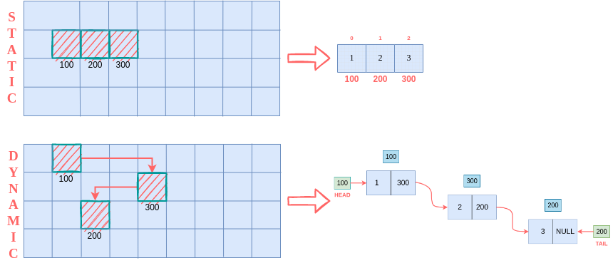

# Introduction

## Linked List - A linear data structure

Linked + List = Linked List

As shown in fig(a), a linked list is a sequential collection of nodes forming together a linear ordering where the elements are not stored at contiguous memory locations. Linked List are linear which means that they are traversed in linear sequential fashion.

<figure markdown>

<figcaption>Fig.(a)</figcaption>
</figure>

In simple words, a linked list is a collection of nodes of similar dataypes. Each node is a single object of a linked list and each object contains the data and the information about its immediate neighbor. We can think 'node' as a user-defined datatype containing two things:

1. **data**: 
It contains the actual data to be stored with datatype as the dtype of the data for eg. int 5.

2. **next**: 
It contains the address of the next node or NULL if no next node is present. It's datatype is "node*" as it is a pointer to the next node or we can say that- as it stores the address of the next node.

We will make a "node" class for defining node datatype and hence, keep in mind that, the datatype of a node is "node". Structure of a node is illustrated in fig(b).

<figure markdown>

<figcaption>Fig.(b)</figcaption>
</figure>

By now, we can understand that each node stores the address of the next node. But, who will store the address of the very first node of the linked list. For this, we make a <strong>head</strong> pointer of datatype "node*" (as it is a pointer to "node" datatype). Similarly, we can also maintain a <strong>tail</strong> pointer for traversing the linked list from right to left.

## Coding a node class

## Arrays vs Linked List

### Memory Management

<figure markdown>

<figcaption>Fig.(c)</figcaption>
</figure>

## Types of Linked List

## Resources
1. [What’s a Linked List, Anyway?](https://medium.com/basecs/whats-a-linked-list-anyway-part-1-d8b7e6508b9d), Vaidehi Joshi
2. [Linked List- Introduction](https://www.geeksforgeeks.org/linked-list-set-1-introduction/), GeeksforGeeks
3. [Types of Linked List](https://www.javatpoint.com/ds-types-of-linked-list), Javatpoint
